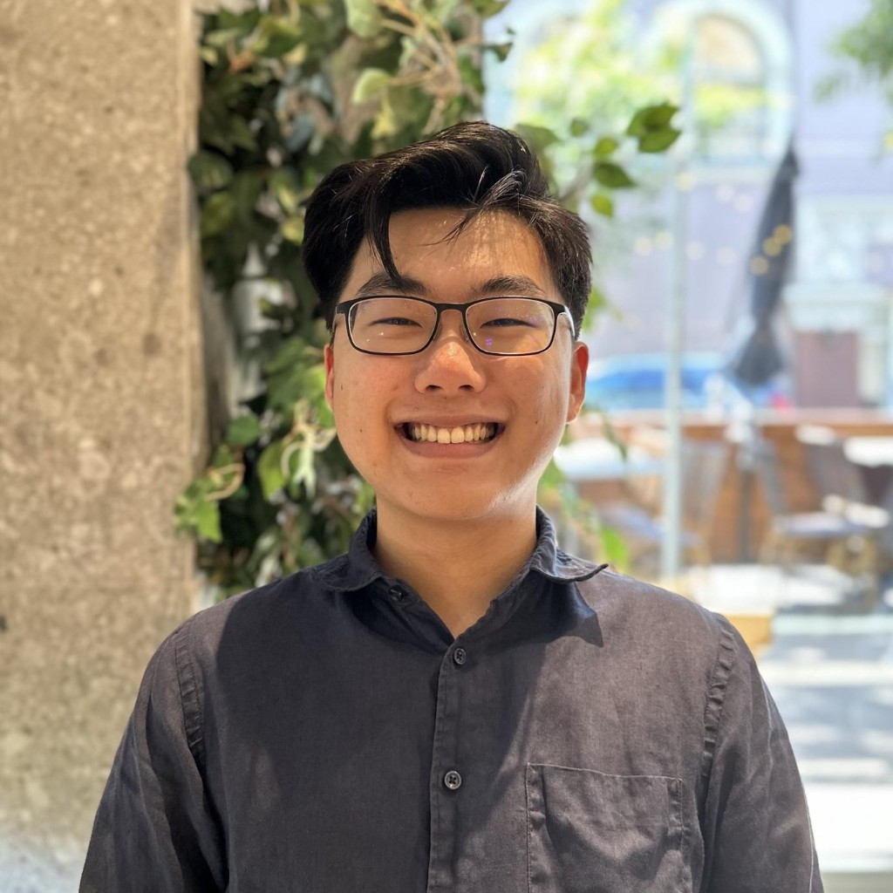

```{=html}
<div class="home-page">
  <header class="intro">
    <div class="intro-body">
      <p>
        I am a PhD student at <a href="https://bair.berkeley.edu/">BAIR</a>, where I am lucky to work with
        <a href="https://www.cs.berkeley.edu/~nika/">Nika Haghtalab</a> and
        <a href="https://people.eecs.berkeley.edu/~jordan/">Mike Jordan</a>.
        I like machine learning theory and the foundations of probability.
        Before Berkeley, I did my BS and MS at Penn, where I had the privilege of working with
        <a href="https://nikolaimatni.github.io/">Nik Matni</a>.
      </p>

      <p class="contact">
        Email: bl.ee AT berkeley DOT edu
      </p>

      <p>
        I help organize the CLIMB seminar. Please reach out if you'd like to give a talk!
      </p>
    </div>

    
  </header>

  <section id="research">
    <h2>Research</h2>

    <article class="paper">
      <p class="title">
        <a href="https://arxiv.org/abs/2606.27315">Blackwell Approachability and Gradient Equilibrium are Equivalent</a>
      </p>
      <p class="authors">
        <strong>Brian W. Lee</strong>, Nika Haghtalab, Michael I. Jordan, and Ryan J. Tibshirani ·
        <span class="publication-venue">COLT 2026</span> ·
        <a href="https://proceedings.mlr.press/v336/lee26c.html">Extended abstract</a>
      </p>
    </article>

  </section>
</div>
```
